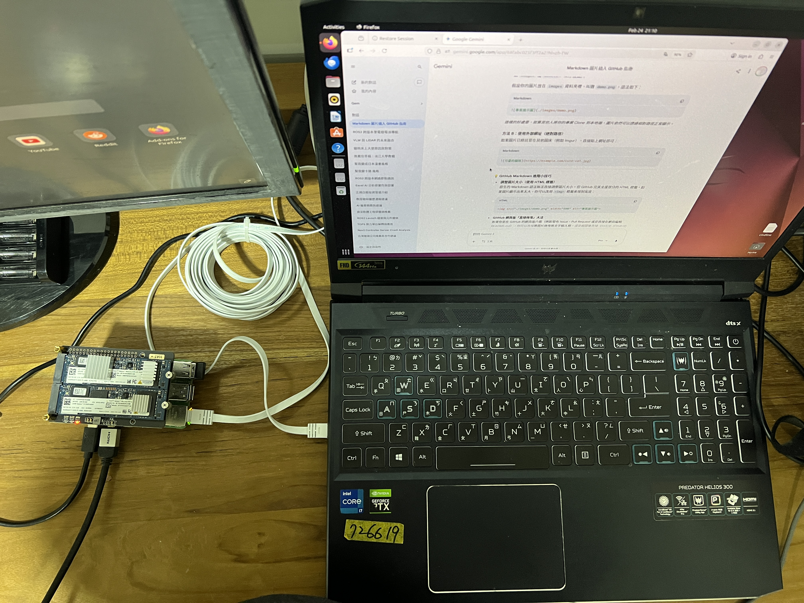

本專案基於異構運算與分散式ROS2架構，將Nav2路徑規劃與避障演算法Offload至邊緣運算節點(Raspberry Pi 5)，實現核心算力的精準分配。同時，系統透過CycloneDDS中介層確保跨機大量特徵數據的低延遲傳輸，使x86主機得以專注於高吞吐量的環境模擬與視覺化渲染，提升整體導航控制迴圈的即時性與穩定度。

實體成果影片 https://youtu.be/mxfidJcO7Mo
RPI5螢幕錄影成果影片 https://youtu.be/t3TaJn3ES-M
github: https://github.com/Marc66weed/distributed_ros2_nav.git

# ROS2跨版本跨系統分散式導航系統架構(Humble+Jazzy)完整建置筆記
本筆記記錄如何從零開始，透過CycloneDDS與實體網路線，將負責環境模擬的x86筆電(ROS2 Humble)，與負責核心導航運算的樹莓派(ROS2 Jazzy)進行對接，達成高效的算力分配。

## 系統硬體與環境架構
* **Host 1(視覺化與模擬端)**: x86 筆電(Acer Predator)/ Ubuntu 22.04 / ROS 2 Humble
* **Host 2(導航大腦端)**: ARM Raspberry Pi 5 / Ubuntu 24.04 / ROS 2 Jazzy
* **通訊協定**: CycloneDDS

## 階段一：實體網路連線與 IP 設定(Network Setup)
為了確保大量雷達資料(LiDAR)與座標轉換(TF)的傳輸品質，兩台機器不使用無線網路，而是透過**網路線**直接對連。

### 1. 設定筆電端(Humble)靜態 IP
1. 進入 Ubuntu 網路設定 (Settings -> Network -> Wired)。
2. 新增或修改 IPv4 設定，將 Method 改為 **Manual (手動)**。
3. 設定 Address: `192.168.x.x` (請依據實際網段自行定義)
4. Netmask: `255.255.255.0`
5. 套用並重新開啟網路連線。

### 2. 設定樹莓派端(Jazzy)靜態 IP
1. 同樣進入樹莓派的網路設定，將 IPv4 改為 **Manual**。
2. 設定 Address: `192.168.x.x`(必須與筆電在同一網段)
3. Netmask: `255.255.255.0`
4. 套用並重新連線。

### 3. 連線測試
在兩台機器的terminal互相ping對方的ip，確認實體連線暢通且無掉包：
-c　次數 -I 指定網卡
bash
# 筆電端 ping 樹莓派
ping 192.168.x.x

# 樹莓派端 ping 筆電
ping 192.168.x.x

## 階段二：時序對齊與系統時間同步(Time Synchronization)
ROS 2 的 TF 極度依賴時間戳。若兩台機器系統時間存在誤差，會導致RViz畫面嚴重跳動、Nav2 找不到機器人位置而報錯。

1. 系統硬體時間同步(使用 Chrony)
確認兩台機器都有連上網際網路後，安裝並啟動 chrony 進行底層時間校準：

Bash
sudo apt update
sudo apt install chrony -y
sudo systemctl restart chrony
(註：若在無對外網路的封閉環境，需修改 /etc/chrony/chrony.conf 將筆電設為 NTP Server，樹莓派設為 Client 指向筆電 IP)

2. ROS 2 模擬時間(Sim Time)對齊機制
因為我們底層是執行 Gazebo 模擬器，必須強迫跨機的所有節點都捨棄系統真實時間，改用 Gazebo 發布的 /clock Topic 作為共同時間基準：
筆電端：RViz2 啟動指令必須後綴 use_sim_time:=true。
樹莓派端：Nav2 的參數檔(test_nav.yaml)中，必須確保所有節點(amcl, controller_server, planner_server 等)都已明確設定 use_sim_time: true。

## 階段三：CycloneDDS 中介層設定
1. 建立設定檔 cyclonedds.xml
在兩台機器的專案目錄下，備有 cyclonedds.xml。必須明確指定綁定那張實體網卡，強制 ROS 2 走實體線傳輸資料。

XML
<?xml version="1.0" encoding="UTF-8" ?>
<CycloneDDS xmlns="[https://cdds.io/config](https://cdds.io/config)" xmlns:xsi="[http://www.w3.org/2001/XMLSchema-instance](http://www.w3.org/2001/XMLSchema-instance)" xsi:schemaLocation="[https://cdds.io/config](https://cdds.io/config) [https://raw.githubusercontent.com/eclipse-cyclonedds/cyclonedds/master/etc/cyclonedds.xsd](https://raw.githubusercontent.com/eclipse-cyclonedds/cyclonedds/master/etc/cyclonedds.xsd)">
    <Domain id="any">
        <General>
            <NetworkInterfaceAddress>eth0</NetworkInterfaceAddress> 
        </General>
    </Domain>
</CycloneDDS>

2. 環境變數設定(.bashrc)
在兩台機器的 ~/.bashrc 檔案最下方，加入以下環境變數，將大腦神經接上 CycloneDDS：

Bash
#隔離環境：指定群組 ID(兩台機器數字必須完全一致)
export ROS_DOMAIN_ID=30
#強制通訊底層使用 CycloneDDS
export RMW_IMPLEMENTATION=rmw_cyclonedds_cpp
#指定 DDS 設定檔路徑(請依據實際存放路徑修改)
export CYCLONEDDS_URI=file:///home/marc4/Desktop/distributed_ros2_nav/rpi5_jazzy_distributed/cyclonedds.xml
存檔後，兩台機器皆須執行 source ~/.bashrc 讓設定生效。

## 階段四：筆電端啟動程序(Humble)
筆電負責開啟模擬環境、視覺化監控，以及處理跨版本的指令橋接。請開啟終端機，分成三個分頁依序執行：

1. 啟動 Gazebo 模擬世界
Bash
ros2 launch turtlebot3_gazebo turtlebot3_world.launch.py
2. 啟動速度橋接程式(cmd_vel_bridge.py)
用來解決跨版本(Humble to Jazzy)或 QoS 不匹配時，導致機器人收不到指令速度指令的問題。

Bash
python3 ~/Desktop/distributed_ros2_nav/nb_humble/cmd_vel_bridge.py
3. 啟動 RViz2 視覺化儀表板
載入預先排版好的介面設定檔，並強制套用模擬時間。

Bash
ros2 launch nav2_bringup rviz_launch.py rviz_config:=~/Desktop/distributed_ros2_nav/nb_humble/distrbute_nav_view.rviz use_sim_time:=true
## 階段五：樹莓派大腦啟動程序(Jazzy)
樹莓派負責吃下所有雷達與里程計資料，進行算力消耗最大的路徑規劃 (Nav2) 與避障演算法。

1. 啟動 Nav2 導航大腦
請確認 test_nav.yaml 中已優化縮小 robot_radius，且地圖檔(.yaml 及 .pgm) 已準備妥當。
開啟樹莓派終端機執行：

Bash
ros2 launch ~/Desktop/distributed_ros2_nav/rpi5_jazzy_distributed/yours.launch.py
2. 開始分散式導航任務
當樹莓派終端機顯示所有Lifecycle Node(生命週期節點)啟動完成，且沒有黃色/紅色報錯後：切換回筆電端的RViz2畫面。若機器人初始位置與地圖不符，點擊上方工具列的 2D Pose Estimate 給初始定位。
點擊上方工具列的 2D Goal Pose 工具，在地圖上點擊並拖曳給定目標點與頭方向。觀察樹莓派規劃出的紅色路徑，筆電端的 Gazebo 機器人即會開始移動，完成！